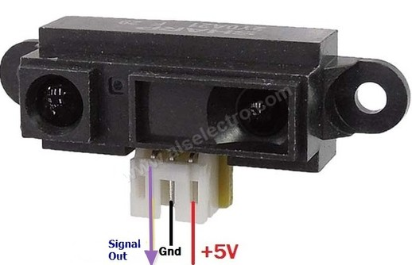
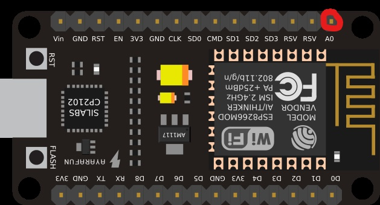

# Workshop 1: Hello World IoT

## Table of contents

- [Description](#description)
- [Software And Hardware](#software-and-hardware)
- [Part1](#part-1)
  - [Prepare Arduino IDE](#prepare-arduino-ide)
  - [Run Blink Program](#run-blink-program)
  - [Connect NodeMCU to Wifi](#connect-nodemcu-to-wifi)
- [Part02](#part02)
  - [Connect Circuit](#connect-circuit)

## Description

## Software And Hardware

1. Arduino IDE for Windows [Download Here](https://www.arduino.cc/download_handler.php?f=/arduino-1.8.5-windows.exe)
    - For other versions : [Click here](https://www.arduino.cc/en/Main/Software)

1. Install driver : [here](https://www.silabs.com/products/development-tools/software/usb-to-uart-bridge-vcp-drivers)

1. NodeMCU (ESP8266)
    - You can buy it from [here](https://store.fut-electronics.com/products/nodemcu-esp8266-programming-and-development-kit)
    

## Part 1

### Prepare Arduino IDE

- Start Arduino IDE
- Click **File** -> **Preferences**
- Next to **Additional Boards Managers URLs**, enter ```http://arduino.esp8266.com/stable/package_esp8266com_index.json```
- Click **Ok**
- Click **Tools** -> **Boards** -> **Board Manager**
- Search for ```esp8266```
- Select first found item -> **Install**
- Connect NodeMCU using Micro USB cable
- Wait for drivers to be installed
- Click **Tools** -> **Port** -> **COM** Port

### Run Blink Program

- Copy the code below to the IDE
    [Part 1](code/01_blink.ino)
    ```c
    # define LED D4 // Use built-in LED which connected to D4 pin or GPIO 2

    void setup() {
    pinMode(LED, OUTPUT);     // Initialize the LED as an output
    }

    void loop() {
    digitalWrite(LED, HIGH);  // Turn the LED off because the LED is active low
    delay(1000);            // Wait a second
    digitalWrite(LED, LOW);   // Turn the LED on because the LED is active low
    delay(1000);              // Wait a second
    }
    ```

- Choose Tools -> Boards -> Nodemcu 1.0 (ESP-12E Module)
- Choose Tools -> Port -> COM(Number from 1 to 9)
- Verify the code using this button
    
- Make sure the board is connected and the port is selected
- Upload
    
- You should see a blinking led on the board
- Success!

### Connect NodeMCU to Wifi

- Copy the code below to the IDE

[Part 2](code/02_wifi_connect.ino)

```c
#include "ESP8266WiFi.h"

// WiFi parameters to be configured
const char* ssid = "YOUR WIFI NETWORK NAME";
const char* password = "YOUR WIFI PASSWARD";

void setup(void)
{
  Serial.begin(9600);
  // Connect to WiFi
  WiFi.begin(ssid, password);

  // while wifi not connected yet, print '.'
  // then after it connected, get out of the loop
  while (WiFi.status() != WL_CONNECTED) {
     delay(500);
     Serial.print(".");
  }
  //print a new line, then print WiFi connected and the IP address
  Serial.println("");
  Serial.println("WiFi connected");
  // Print the IP address
  Serial.println(WiFi.localIP());

}
void loop() {
  // Nothing
}
```

- Edit the code
  - Change the ssid to your network name
  - Change the password to your Wifi password
- Verify the code using this button
    
- Make sure the board is connected and the port is selected
- Upload
    
- Open the serial monitor using CTRL+SHIFT+M
- Make sure the baud rate is set to 9600.
- You should see on the monitor the IP for the device.
- Success!

### Control the LED over Wifi

- Copy the code below to the IDE

[Part 3](code/03_wifi_led.ino)

```c
#include <ESP8266WiFi.h>

const char* ssid = "YOUR WIFI NETWORK NAME";
const char* password = "YOUR WIFI PASSWARD";

# define ledPin D4
WiFiServer server(80);

void setup() {
  Serial.begin(115200);
  delay(10);

  pinMode(ledPin, OUTPUT);
  digitalWrite(ledPin, LOW);

  // Connect to WiFi network
  Serial.println();
  Serial.println();
  Serial.print("Connecting to ");
  Serial.println(ssid);

  WiFi.begin(ssid, password);

  while (WiFi.status() != WL_CONNECTED) {
    delay(500);
    Serial.print(".");
  }
  Serial.println("");
  Serial.println("WiFi connected");

  // Start the server
  server.begin();
  Serial.println("Server started");

  // Print the IP address
  Serial.print("Use this URL to connect: ");
  Serial.print("http://");
  Serial.print(WiFi.localIP());
  Serial.println("/");

}

void loop() {
  // Check if a client has connected
  WiFiClient client = server.available();
  if (!client) {
    return;
  }

  // Wait until the client sends some data
  Serial.println("new client");
  while(!client.available()){
    delay(1);
  }

  // Read the first line of the request
  String request = client.readStringUntil('\r');
  Serial.println(request);
  client.flush();

  // Match the request

  int value = LOW;
  if (request.indexOf("/LED=ON") != -1)  {
    digitalWrite(ledPin, LOW);
    value = LOW;
  }
  if (request.indexOf("/LED=OFF") != -1)  {
    digitalWrite(ledPin, HIGH);
    value = HIGH;
  }

// Set ledPin according to the request
//digitalWrite(ledPin, value);

  // Return the response
  client.println("HTTP/1.1 200 OK");
  client.println("Content-Type: text/html");
  client.println(""); //  do not forget this one
  client.println("<!DOCTYPE HTML>");
  client.println("<html>");

  client.print("Led pin is now: ");

  if(value == HIGH) {
    client.print("On");
  } else {
    client.print("Off");
  }
  client.println("<br><br>");
  client.println("<a href=\"/LED=ON\"\"><button>Turn On </button></a>");
  client.println("<a href=\"/LED=OFF\"\"><button>Turn Off </button></a><br />");
  client.println("</html>");

  delay(1);
  Serial.println("Client disonnected");
  Serial.println("");

}
```

- Edit the code
  - Change the ssid to your network name
  - Change the password to your Wifi password
- Verify the code using this button
    
- Make sure the board is connected and the port is selected
- Upload
    
- Open the serial monitor using CTRL+SHIFT+M
- Make sure the baud rate : 115200
- You should see information about the Wifi connection
- Using another device connected on the same network
    - Open web-browser
    - Enter the IP of the NodeMCU and add "/LED=ON" to enable the LED
    - use "/LED=OFF" to disable the LED

#### Code explanation

- Connect to the Wifi :

```c
  WiFi.begin(ssid, password);

  while (WiFi.status() != WL_CONNECTED) {
    delay(500);
    Serial.print(".");
  }
```

- Start HTTP Server

```c
server.begin();
```

- Get client that is connected to the server

```c
WiFiClient client = server.available();
  if (!client) {
    return;
  }
```

- Read request coming from client

```c
String request = client.readStringUntil('\r');
Serial.println(request);
client.flush();
```

- Control the LED using input from the client request

```c
if (request.indexOf("/LED=ON") != -1)  {
    digitalWrite(ledPin, LOW);
    value = LOW;
}
if (request.indexOf("/LED=OFF") != -1)  {
    digitalWrite(ledPin, HIGH);
    value = HIGH;
}
```

- Build HTML view for the client

```c
// Return the response
  client.println("HTTP/1.1 200 OK");
  client.println("Content-Type: text/html");
  client.println(""); //  do not forget this one
  client.println("<!DOCTYPE HTML>");
  client.println("<html>");

  client.print("Led pin is now: ");

  if(value == HIGH) {
    client.print("On");
  } else {
    client.print("Off");
  }
  client.println("<br><br>");
  client.println("<a href=\"/LED=ON\"\"><button>Turn On </button></a>");
  client.println("<a href=\"/LED=OFF\"\"><button>Turn Off </button></a><br />");
  client.println("</html>");
```

## Part02

### Connect Circuit

- Hold the sensor in the position below and connect 3 wires as shown
  
- It is a good practice to use different colors for the wires to identify the use of each pin
- Mark down on a note the color of the wire related to the pin mode
- Make sure the Nodemcu is not connected to the PC
- Connect the other side of the wires to the Nodemcu as follows
  - Connect the **+5V** wire to any port with label : **3.3V**
  - Connect the **GND** wire to any port with label : **GND**
  - Connect the **Signal Out** to the port with label : **A0** as shown below
    

### Test Sensor

- Connect the USB cable to Nodemcu
- Connect the other side to the PC
- Copy the code below to the IDE

[Part 4](code/04_read_sensor.ino)

```c
void setup() {
  // initialize serial communication at 9600 bits per second:
  Serial.begin(9600);
}

// the loop routine runs over and over again forever:
void loop() {
  // read the input on analog pin 0:
  int sensorValue = analogRead(A0);

  // print out the value you read:
  Serial.println(sensorValue);
}
```

- Verify the code using this button
    
- Make sure the board is connected and the port is selected
- Upload
    
- Open the serial monitor using CTRL+SHIFT+M
- Make sure the baud rate : 9600
- You should see readings coming from the sensors
- Notice the change of the readings while apporaching your hand from the sensor
- Note down the value you would like to set as a threshold.

### Control Remote Nodemcu Using HTTP

- Get [Part 3](code/04_read_sensor.ino) running on the first Nodemcu
- Note the ip address assigned to that device
- Copy the code below to the IDE

[Part 5](code/05_control_led_with_sensor.ino)

```c
#include "ESP8266WiFi.h"
#include <ESP8266HTTPClient.h>

// WiFi parameters to be configured
const char* ssid = "YOUR WIFI NETWORK NAME";
const char* password = "YOUR WIFI PASSWARD";

void setup(void)
{
  Serial.begin(9600);
  // Connect to WiFi
  WiFi.begin(ssid, password);

  // while wifi not connected yet, print '.'
  // then after it connected, get out of the loop
  while (WiFi.status() != WL_CONNECTED) {
     delay(500);
     Serial.print(".");
  }
  //print a new line, then print WiFi connected and the IP address
  Serial.println("");
  Serial.println("WiFi connected");
  // Print the IP address
  Serial.println(WiFi.localIP());

}

void loop() {
  HTTPClient http;
  int sensorValue = analogRead(A0);

  if (sensorValue > THRESHOLD){
    //Led On
    http.begin("http://ip-address/LED=ON");
    int httpCode = http.GET();
    String payload = http.getString();
    Serial.println(payload);
  }else{
    //Led Off
    http.begin("http://ip-address/LED=OFF");
    int httpCode = http.GET();
    String payload = http.getString();
    Serial.println(payload);
  }

  http.end();
  delay(500);
}
```

- Verify the code using this button
    
- Make sure the board is connected and the port is selected
- Since this time, two boards might be connected to the same PC, please make sure to choose the correct **port** for the second board
- Upload
    
- Open the serial monitor using CTRL+SHIFT+M
- Make sure the baud rate : 9600
- Try to move your hands in front of the sensor and check if the led on the other device is turning off and on
- If the system is not behaving as expected, try to include this in the code to see the actual sensors readings

```c
Serial.println(sensorValue);
```

- You may need to adjust the threshold